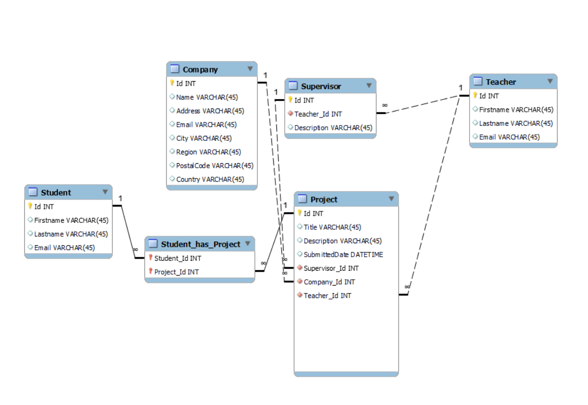

# Project Manager

The Project Manager is designed to make the final year easier for students to work on their final project.
They can use this platform to get inspired by already realized project ideas. They can also contact a supervisor to start a project. Companies and teachers can offer school projects.

The main goal is to give students more recognition so that their final projects do not gather dust in the library, but can be used in the digital world and help future graduates.

## Database

1st Project
2. supervisor
3. teacher
4. company
5. student
6. studenthasProject

### Graphical representation

